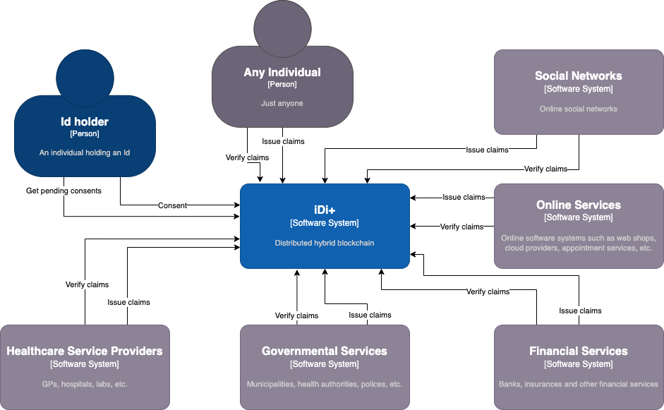
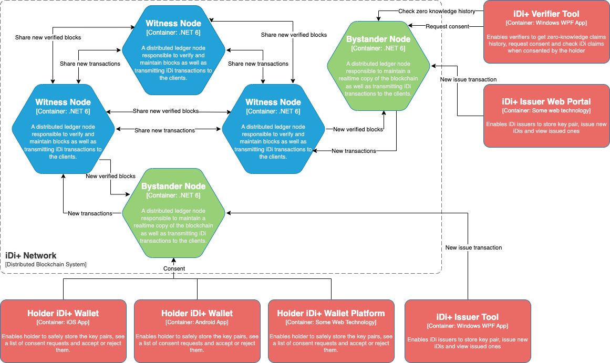

# iDi+

iDi+ is a hybrid distributed ledger working based on a double encryption mechanism to provide a public Self Sovereign Identity platform. iDi+ is **hybrid**, meaning that it can be accessed and used publicly but only selected nodes will be able to verify transactions.

## Why Blockchian?
iDi+ has two pillars, **double-encryption** and **blockchain**, each of which is used to serve a specific purpose:
- Double-encryption enables self-sovereign identity. It allows the claims to be encypted twice with two distict keys each controlled by a unique entity: the issuer and the holder. This way the verifiers can always make sure the claims are issued by the issuer of interest and also holders can make sure their claims can not be disclosed to any verifier without their explicit consent. 
- On the other hand, blockchain technology allows entities with conflicting interests to maintain trust and use the same SSI platform for their clients. These entities can be political entities like governments as well as financial entities and corporates. It allows rival companies and governments to maintain the same global SSI platform.

***This project is still under development...***

# Glossary

**Issuer**: An entity which issues and certifies a subset of a holder’s identity

**Holder**: An entity whose identity is certified and/or verified by other entities

**Verifier**: An entity which verifies a subset of a holder’s identifiers.

**Identifier**: The granular piece of information which builds up a holder’s identity, i.e. claims. (e.g. Passport number, Name, email, postal address, driving license number, photo, etc.)

**Subject**: The subject of each identifier. Each identifier belongs to a subject. (e.g. Passport subject may have the following identifiers: Passport number, photo, issue date, expiration date, etc.)

**Issue transactions**: Transactions which are created by issuers to create or update a holder’s attribute

**Consent transactions**: Transitions created by the holder to send an issued attribute to a specific verifier

## Architecture
### Context View

### Container View

# How it works? (30k feet view)

Each issuer, holder and verifier has a unique Public/Private key pair. Also a 24-byte wallet address is derived from the public key.

**Step 1**
When an issuer issues identifiers for a subject, it creates an **issue transaction** for each identifier, encrypts them by the holder's public key and then signs with its own private key and pushes them to the blockchain.

**Step 2**
When a verifier requests some identifiers of a holder the flow will be:
1. The verifier reads (e.g. scan) the holder’s public key
2. The verifier, checks the blockchain for the latest transactions containing the holder’s public key, the subject issuer’s public key and the key of the Identifier(s) of interest
3. If such transactions are found, the verifier compiles a list of the issue transaction Ids and creates a request QR code which consists of the list plus the verifier’s public key
4. The holder reads (e.g. scan) the QR code and views the list of requested transactions.
5. If accepted, the holder fetches the transactions from the blockchain.
6. For each transaction, the holder decrypts the identifier data with its own private key (data still encrypted by issuer's private key), and encrypts it again with its own private key and then with the verifier's public key and creates a new **consent transaction** per identifier
7. Verifier fetches the consent transactions from the blockchain, decrypts them with their own private key and then with the holder's public key and then the issuer's public key. If decrypted successfully, the issue transaction Id, holder public key, subject and the identifier key are verified. The verifier can then happily see and use the identifiers.

> -   To prevent collusion between two holders, the Issue Transaction Id, Holder public key and Identifier key are also signed by the issuer along with the identifier value so that a holder can not compromise its identifier to another holder allowing it to sign fake data for a verifier.  
>-   Signing the issue transaction Id by the issuer also guarantees that a holder can not sign another issue transaction data of itself for a verifier
>- In addition to the blockchain there is another virtual chain between the transactions of the same id tuple (issuer, holder, identifier), so the history of changes of an identifier of a holder is maintained. This can be a good help when it comes to financial ecosystems and KYC concepts.