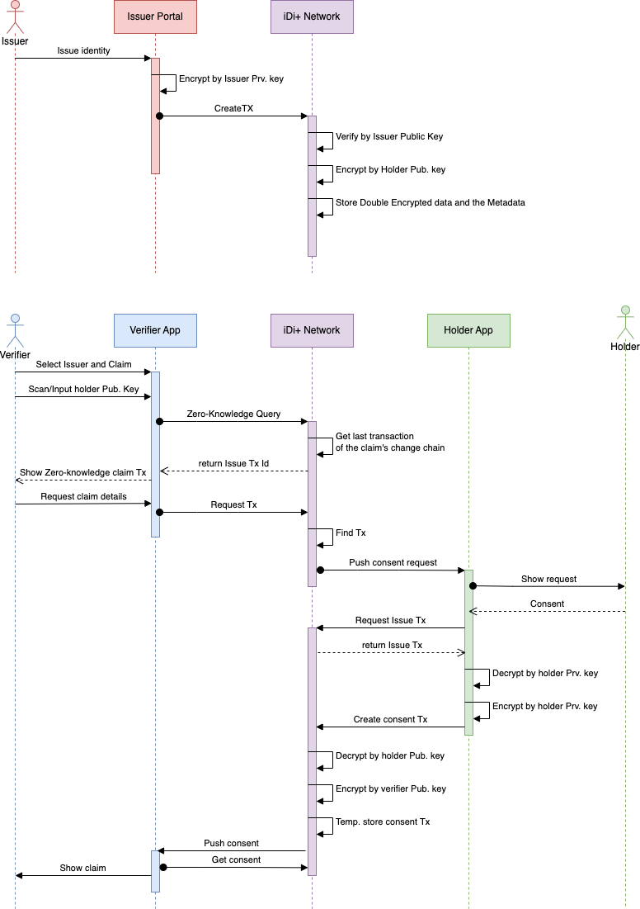

# iDi+

iDi+ is a hybrid distributed ledger working based on a double encryption mechanism to provide a public Self Sovereign Identity platform. iDi+ is **hybrid**, meaning that it can be accessed and used publicly but only selected nodes will be able to verify transactions.

## Why Blockchian?
iDi+ has two pillars, **double-encryption** and **blockchain**, each of which is used to serve a specific purpose:
- Double-encryption enables self-sovereign identity. It allows the claims to be encypted twice with two distict keys each controlled by a unique entity: the issuer and the holder. This way the verifiers can always make sure the claims are issued by the issuer of interest and also holders can make sure their claims can not be disclosed to any verifier without their explicit consent. 
- On the other hand, blockchain technology allows entities with conflicting interests to maintain trust and use the same SSI platform for their clients. These entities can be political entities like governments as well as financial entities and corporates. It allows rival companies and governments to maintain the same global SSI platform.

***This project is still under development...***

# Glossary

**Issuer**: An entity which issues and certifies a subset of a holder’s identity

**Holder**: An entity whose identity is certified and/or verified by other entities

**Verifier**: An entity which verifies a subset of a holder’s identifiers.

**Identifier**: The granular piece of information which builds up a holder’s identity, i.e. claims. (e.g. Passport number, Name, email, postal address, driving license number, photo, etc.)

**Subject**: The subject of each identifier. Each identifier belongs to a subject. (e.g. Passport subject may have the following identifiers: Passport number, photo, issue date, expiration date, etc.)

**Issue transactions**: Transactions which are created by issuers to create or update a holder’s attribute

**Consent transactions**: Transitions created by the holder to send an issued attribute to a specific verifier

## Architecture
### Context View

### Container View

# How it works? (30k feet view)

Each issuer, holder and verifier has a unique Public/Private key pair.

**Issue**
1. When an issuer issues identifiers for a subject, it creates an **issue transaction** for each identifier, encrypts them by the its own private key and then sends if off to iDi+ network.
1. The iDi+ witness node receiving the signed transaction will fist verify the issuer by decrypting the signed data with issuer's public key. 
1. It then extracts the holder public key from the transaction and encrypts the signed data again by the holder's public key.
1. The double encrypted data will then be stored in the blockchain.

**Verify**

To verify an identity claim (or a group of them) the verifier needs to send the subject name, the claim name and the holder's public key (e.g. by scanning a QR) to iDi+ network to lookup the claim. This is called a zero-knowlendge lookup because upon this lookup the verifier can immediately know if such a claim exists without seeing its value. A zero-knowledge lookup can be useful in certain cases for example to verify is a person has a driving license or not wihtout having access to any details of the driving license. If the zero-knowledge lookup matches a claim, the transaction Id of the **last update** of that claim will be returned. In case the verifier needs to see details of that claim, then the holder's consent is required. To get the consent and check the details the following steps are required:
1. The verifier sends a consent request to iDi+ network.
2. The network sends the notification of a pending consent to the holder.
3. The holder opens the app and selects the consent request.
4. If the request is accepted by holder, the app requests the corresponding issue transaction from the network.
5. The received issue transaction will be decrypted by holder's private key.
6. The result will be encrypted again by holder's private key.
7. The result double encrypted data will be sent back to the network as a **Consent Transaction**.
8. The network decrypts the consent transaction data by holder's public key.
9. The network encrypts the data again by verifier's public key.
10. The network stores the consent transaction in a temporary store and notifies the verifier that the consent transaction is ready.
11. Verifier can the fetch the consent transaction from the network.
12. The consent transaction will be deleted right after. In case the verifier never fetches the consent transaction it will be destroyed after a certain period of time.

> - To prevent collusion between two holders, the Issue Transaction Id, Holder public key and Identifier key are also signed by the issuer along with the identifier value so that a holder can not compromise its identifier to another holder allowing it to sign fake data for a verifier.  
> - Signing the issue transaction Id by the issuer also guarantees that a holder can not sign another issue transaction data of itself for a verifier
> - In addition to the blockchain there is another virtual chain between the transactions of the same id tuple (issuer, holder, identifier), so the history of changes of an identifier of a holder is maintained. This can be a good help when it comes to financial ecosystems and KYC concepts.

